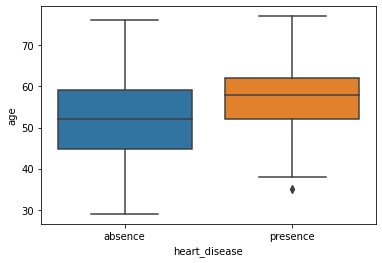
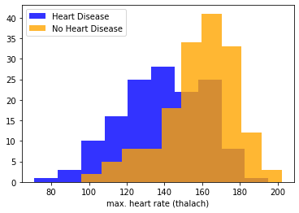

# Analyzing Contributors to Heart Disease
## A codecademy Project

**Objective:** Investigate data from a sample of patients who were evaluated for heart disease at the Cleveland Clinic Foundation. 

Use visualizations and hypothesis testing to evaluate correlations between variables. Incorporate SciPy and Statsmodels to test for statistical significance.

The data was downloaded from the UCI Machine Learning Repository and then cleaned for analysis.

Programming languages and libraries used: 
- python
- pandas
- numpy
- matplotlib
- seaborn

SciPy Statistical Tests used:
- ttest_1samp (One-sample t-test)
- ttest_ind (Two-sample t-test)
- binom_test (Binomial test)
- f_oneway (One-way ANOVA)
- chi2_contingency (Chi-Square Test)

Statsmodels Statistical Tests used:
- pairwise_tukeyhsd (Tukey's Range Test) 

This project was divided into two notebooks (heart_disease_project.ipynb and heart_disease_project_2.ipynb).
It may be easier to view the code by copying/pasting the url for the .ipynb files into [nbviewer](https://nbviewer.jupyter.org/).
